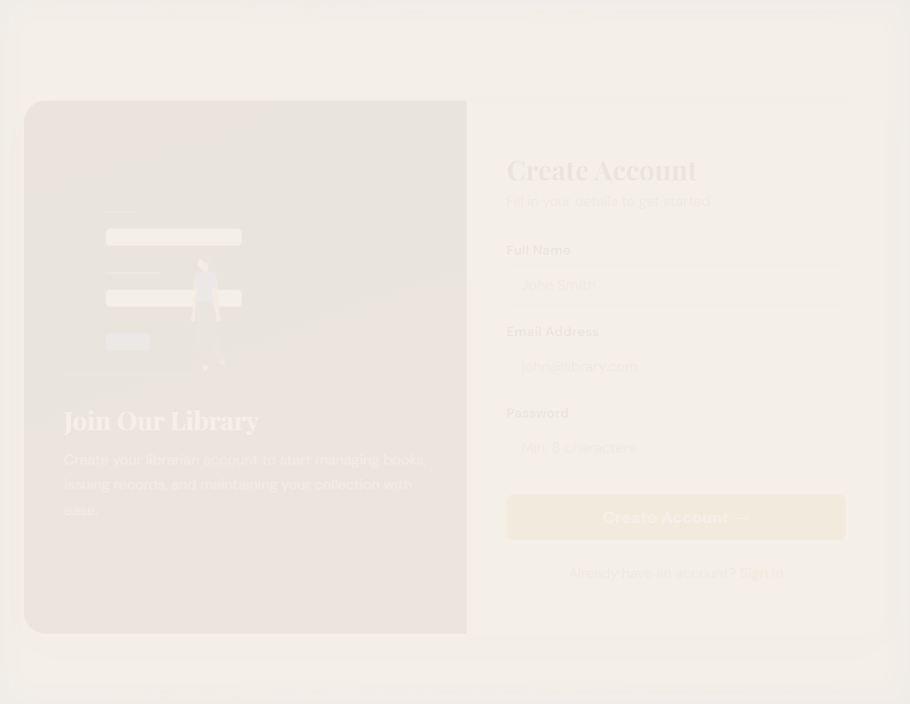
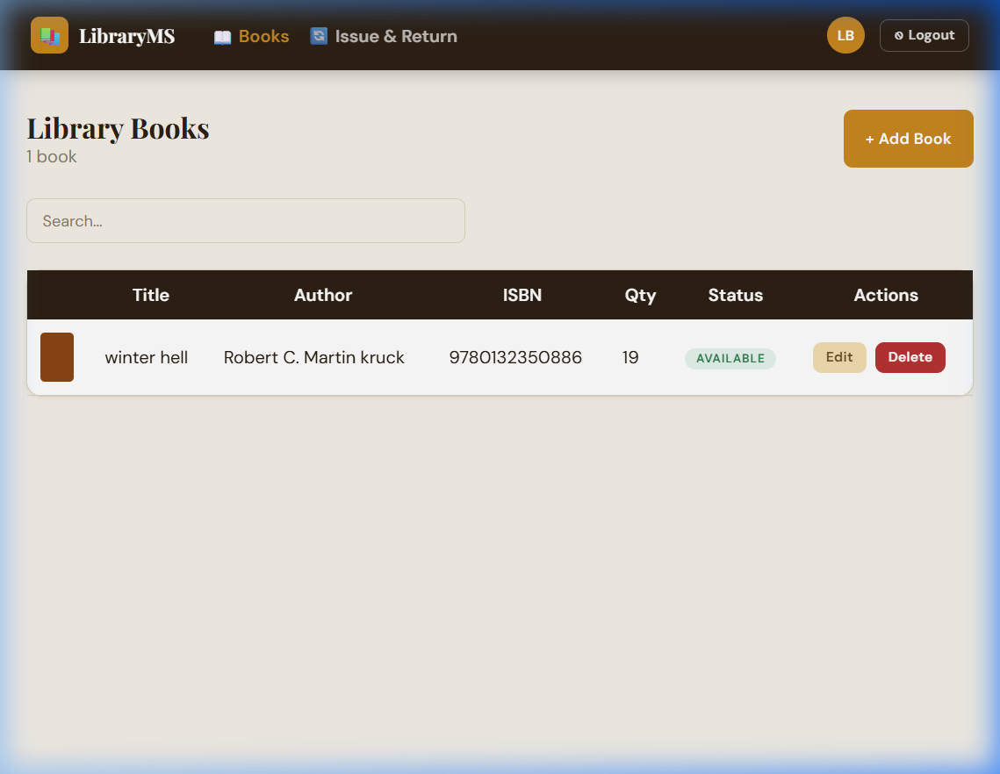
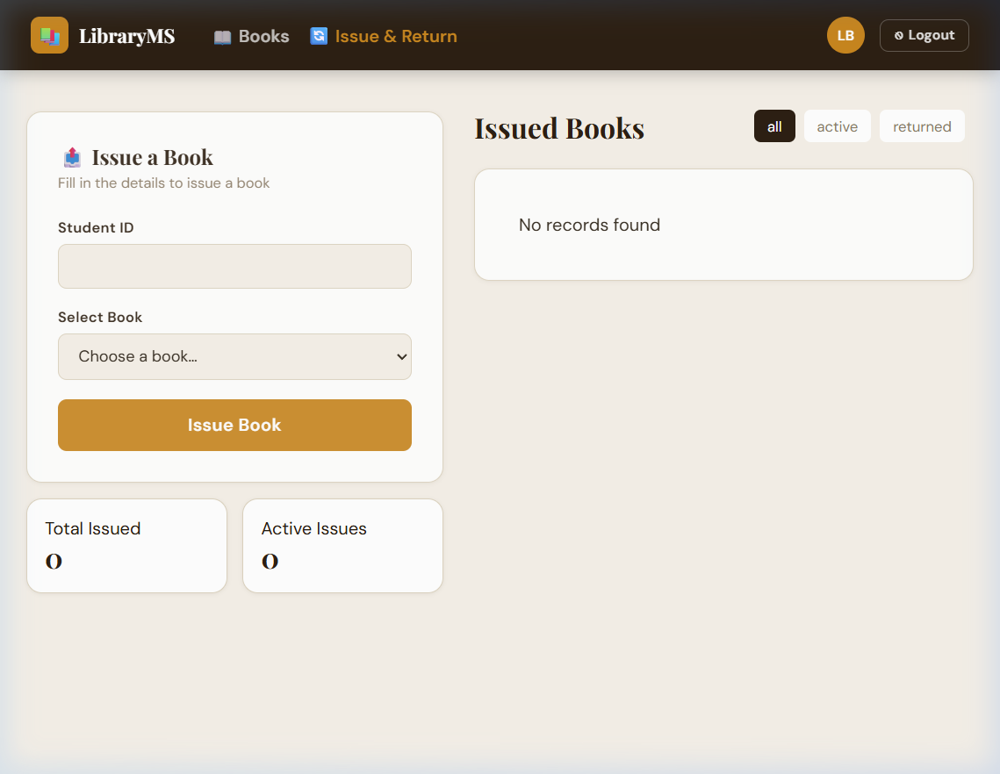

# 📚 Library Management System

A full-stack **Library Management System** built with **React.js** (frontend) and **Node.js + Express + MongoDB** (backend). Designed for librarians to manage books, issue records, and returns with a clean, modern UI.

---

## 🖥️ Screenshots

### 🔐 Login Page


### 📝 Register Page


### 📖 Books Management


### 🔄 Issue & Return


---

## ✨ Features

- 🔐 **JWT Authentication** — Secure login & registration for librarians
- 📖 **Book Management** — Add, edit, delete, and search books (title, author, ISBN)
- 🔄 **Issue & Return System** — Issue books to students, track returns, manage quantities automatically
- 📊 **Live Stats** — Total issued count, active issues at a glance
- 🔎 **Search** — Real-time book search by title, author, or ISBN
- 🛡️ **Protected Routes** — All write operations require authentication
- ✅ **Input Validation** — Server-side and client-side validation
- 🎨 **Premium UI** — Warm library aesthetic with Playfair Display + DM Sans fonts

---

## 🛠️ Tech Stack

| Layer | Technology |
|---|---|
| **Frontend** | React.js 19, React Router v7, Axios |
| **Backend** | Node.js, Express.js 5 |
| **Database** | MongoDB (Mongoose ODM) |
| **Auth** | JWT (jsonwebtoken) + bcryptjs |
| **Styling** | Vanilla CSS with CSS custom properties |
| **Dev Tools** | Nodemon, Create React App |

---

## 📁 Project Structure

```
librarymanagementsystem/
├── backend/
│   ├── config/
│   │   └── db.js              # MongoDB connection
│   ├── controllers/
│   │   ├── authController.js  # Register & Login logic
│   │   ├── bookController.js  # CRUD for books
│   │   └── issueController.js # Issue & Return logic
│   ├── middleware/
│   │   └── authMiddleware.js  # JWT protect middleware
│   ├── models/
│   │   ├── Book.js            # Book schema
│   │   ├── Issue.js           # Issue record schema
│   │   └── Librarian.js       # Librarian (user) schema
│   ├── routes/
│   │   ├── authRoutes.js
│   │   ├── bookRoutes.js
│   │   └── issueRoutes.js
│   ├── .env                   # Environment variables (not committed)
│   └── server.js              # Express app entry point
│
└── frontend/
    ├── public/
    ├── src/
    │   ├── components/
    │   │   ├── Navbar.js      # Sticky navigation bar
    │   │   └── UI.jsx         # Design system (Btn, Badge, Card, etc.)
    │   ├── pages/
    │   │   ├── Login.js
    │   │   ├── Register.js
    │   │   ├── Books.js
    │   │   └── Issue.js
    │   └── App.js             # Routing & auth state
    └── .env                   # REACT_APP_API_URL (not committed)
```

---

## 🚀 Getting Started

### Prerequisites
- Node.js v18+
- MongoDB (local or Atlas)

### 1. Clone the Repository
```bash
git clone https://github.com/jaiakash0786/librarymanagementsystem-.git
cd librarymanagementsystem-
```

### 2. Backend Setup
```bash
cd backend
npm install
```

Create a `.env` file in the `backend/` folder:
```env
MONGO_URI=your_mongodb_connection_string
PORT=5000
JWT_SECRET=your_super_secret_key
```

Start the backend:
```bash
npm run dev
```

### 3. Frontend Setup
```bash
cd frontend
npm install
```

Create a `.env` file in the `frontend/` folder:
```env
REACT_APP_API_URL=http://localhost:5000
```

Start the frontend:
```bash
npm start
```

### 4. Open the App
Visit **http://localhost:3000** in your browser.

---

## 🔌 API Endpoints

### Auth
| Method | Route | Description | Protected |
|---|---|---|---|
| POST | `/api/auth/register` | Register a librarian | ❌ |
| POST | `/api/auth/login` | Login & receive JWT | ❌ |

### Books
| Method | Route | Description | Protected |
|---|---|---|---|
| GET | `/api/books` | Get all books (supports `?search=`) | ❌ |
| POST | `/api/books` | Add a new book | ✅ |
| PUT | `/api/books/:id` | Update a book | ✅ |
| DELETE | `/api/books/:id` | Delete a book | ✅ |

### Issues
| Method | Route | Description | Protected |
|---|---|---|---|
| GET | `/api/issues` | Get all issue records | ❌ |
| POST | `/api/issues` | Issue a book to a student | ✅ |
| PUT | `/api/issues/return/:id` | Mark a book as returned | ✅ |

> 🔐 **Protected** routes require `Authorization: Bearer <token>` header.

---

## 🔒 Security

- Passwords are hashed with **bcryptjs** (10 salt rounds)
- JWT tokens expire in **1 day**
- JWT secret stored in environment variable (never hardcoded)
- `.env` files are excluded from version control via `.gitignore`

---

## 📦 Environment Variables

### Backend (`backend/.env`)
| Variable | Description |
|---|---|
| `MONGO_URI` | MongoDB connection string |
| `PORT` | Server port (default: 5000) |
| `JWT_SECRET` | Secret key for JWT signing |

### Frontend (`frontend/.env`)
| Variable | Description |
|---|---|
| `REACT_APP_API_URL` | Backend base URL (e.g. `http://localhost:5000`) |

---

## 👤 Author

**Jai Akash** — [@jaiakash0786](https://github.com/jaiakash0786)

---

## 📄 License

This project is open source and available under the [MIT License](LICENSE).
